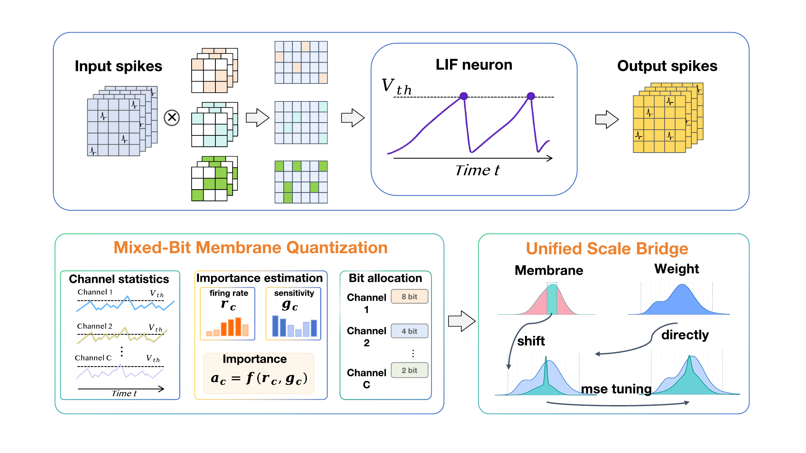

# PTQ4SNN

Code for **[PTQ4SNN: Membrane-Aware Post-Training Quantization for Spiking Neural Networks](https://arxiv.org/abs/2608.07066)**.

[Paper](https://arxiv.org/abs/2608.07066) · [PDF](https://arxiv.org/pdf/2608.07066)

## Overview

PTQ4SNN quantizes both weights and recurrent membrane states using a small calibration
set. Its channel-wise scale bridge couples membrane and weight scales through a
power-of-two factor, while mixed-precision bit allocation (MPBA) assigns 2/4/8-bit
membrane precision using firing activity and quantization sensitivity.



In the paper, **W4/M4** denotes 4-bit weights and an element-count-weighted average
membrane precision of approximately 4 bits. The Unified Scale Bridge is calibrated
under the assigned channel-wise bit widths; protected layers or channels can retain
higher precision.

## Code structure

This repository provides the calibration and evaluation pipeline for convolutional
SNNs, including SEW-ResNet and VGG, with a SEW-ResNet18/CIFAR-100 example.

```text
ptq4snn/
  model/             Backbones and LIF neurons
  quantization/      Weight and membrane quantizers, observers, scale bridge
  solver/            Activity/sensitivity statistics, MPBA, reconstruction, and CLI
  utils/             Data loading and evaluation
exp/sew-resnet18/     SEW-ResNet18 / CIFAR-100 configuration
assets/              Paper overview figure
tests/               CPU checks
```

## Requirements

Use Python 3.10. Install a compatible CUDA-enabled PyTorch/torchvision pair, then:

```bash
pip install -r requirements.txt
```

The CPU checks were validated with PyTorch 2.5.1, torchvision 0.20.1, NumPy 1.26.4,
SciPy 1.15.3, and SpikingJelly 0.0.0.0.14. Calibration and evaluation use CUDA.

## Data and checkpoints

Run commands from the repository root. Extract CIFAR-100 and place your pretrained
checkpoint as follows, or update the paths in `exp/sew-resnet18/config.yml`:

```text
data/
  cifar-100-python/
pretrained/
  sew_resnet18_cifar100.pth
```

The solver loads serialized `ptq4snn.model` model objects, with the dataset, class
count, and time steps already configured. Use trusted checkpoints in this
serialized-model format. Set `gpu` in the configuration to select your device.

## Calibration and evaluation

```bash
python -m ptq4snn.solver.main --config exp/sew-resnet18/config.yml \
  --log_save_dir output/sew-resnet18
```

The example uses 1,024 training samples for calibration and evaluates on the test
split. It combines firing activity and sensitivity with weights `0.8` and `0.2`.
The `target_avg_bits: 4` budget applies to non-stem membrane states; the first
membrane layer is protected at 16 bits. The checkpoint determines the model's
time steps.

| Setting under `quant` | Effect |
| --- | --- |
| `m_qconfig.scale_mode: bridge` | Enable interval-calibrated power-of-two scaling |
| `mix_precise: true` | Allocate channel-wise 2/4/8-bit membrane precision |
| `mix_precise: false` | Use the configured uniform non-stem membrane precision |
| `target_avg_bits: 4` | Set the element-weighted average membrane-bit budget |
| `m_qconfig.scale_mode: reuse` / `observer` | Run the corresponding scale ablation |

Outputs include logs, evaluation metrics in `summary.json`, and a quantized
checkpoint when `process.save_model` is enabled. The **fake-quantization** models use
floating-point tensors to simulate low-bit arithmetic; reported bit counts describe
theoretical storage.

## Tests

```bash
python -m unittest discover -s tests -v
```

The CPU checks cover LIF equivalence with quantization disabled, per-channel bridge
scaling with mixed membrane bits, and the element-weighted MPBA budget.

## Citation

If you find this work useful, please cite:

```bibtex
@article{xie2026ptq4snn,
  title={PTQ4SNN: Membrane-Aware Post-Training Quantization for Spiking Neural Networks},
  author={Xie, Hui and Shi, Tong and Qin, Haotong and Liu, Aishan and Liu, Xiaode and Guo, Jinyang},
  journal={arXiv preprint arXiv:2608.07066},
  year={2026},
  url={https://arxiv.org/abs/2608.07066}
}
```

## Acknowledgements and license

This code uses [SpikingJelly](https://github.com/fangwei123456/spikingjelly)
and [PyTorch](https://pytorch.org/). See [LICENSE](LICENSE) for the Apache-2.0 license.

For questions about this repository, please open a GitHub issue.
